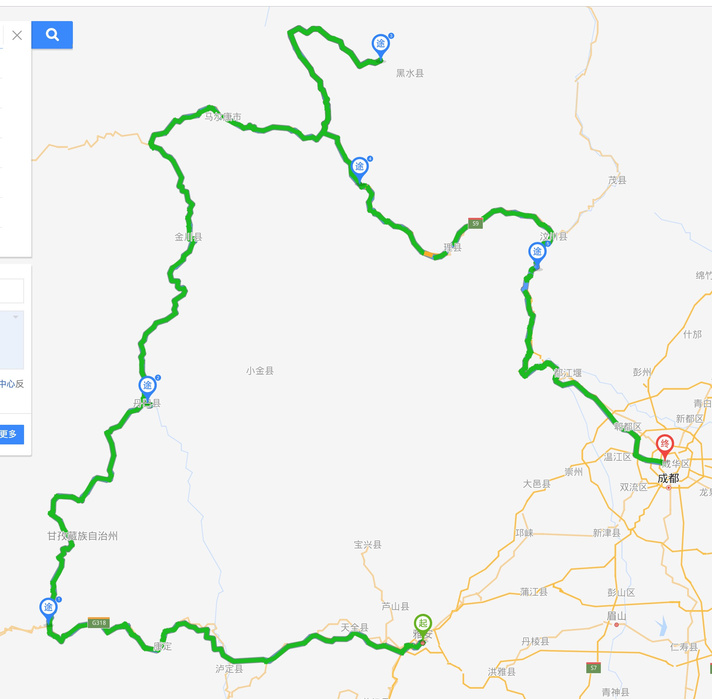
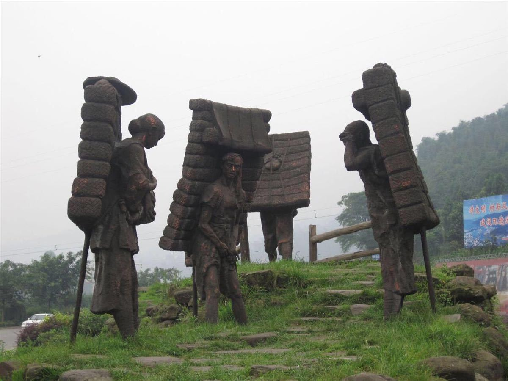
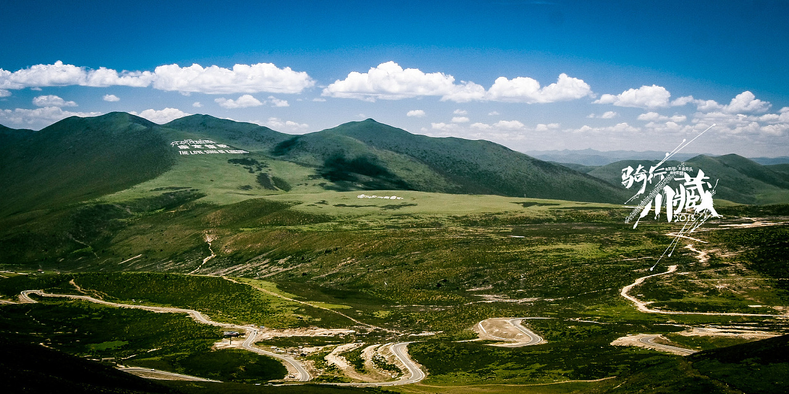
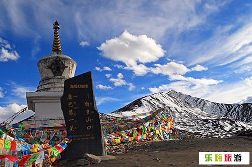
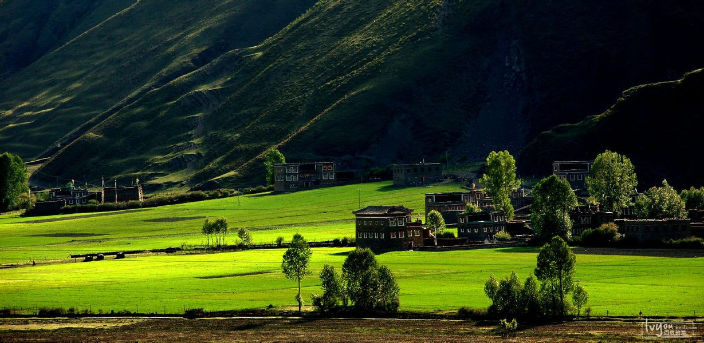
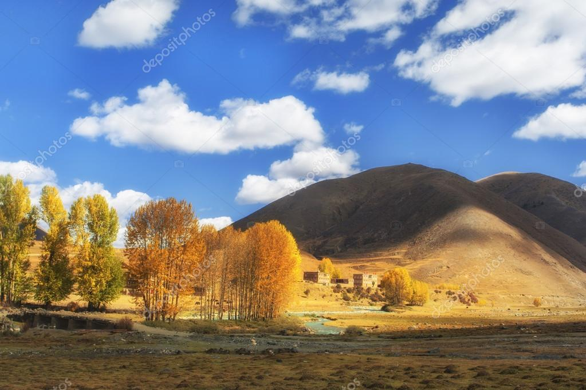

# 川西北小环线
 

D1 重庆-雅安 5个小时  9月30日下午早点走，住雅安 全程高速，提前预定酒店
雅安是茶马古道的重要节点，有著名的三雅：雅鱼、雅女、雅雨，可以去试下雅鱼（我没吃过）。

D2 雅安-新都桥 200公里 4个小时   一半高速一半山路，路况很好，翻越4200米海拔的折多山垭口。新都桥是著名的摄影天堂，风景非常好，可以选择在路边的藏家住宿，价格便宜，也可选择自带帐篷在院子里露营。
如果顺利雅安高速直通康定，如果高速有管制，需要翻越二郎山，到达新都桥的时间应该是下午了，所以最好提前了解雅安到康定高速的情况。
在折多山垭口大概率会有高反，要注意不要激动、跑跳。

D3 新都桥-丹巴  140公里 3小时  此段路线非常漂亮，整个行程的精华，路过塔公草原、雅拉神山景区等。丹巴县城住宿较贵（15年600一晚上），如无法提前预定，可以住路边藏家客栈，价格较低。或往金川方向走。丹巴最出名的是甲居藏寨，是一个成熟景点，有很多酒店客栈，可以在网上提前预定。丹巴还有中路古镇，是一座坐落在高山上的村庄，有很多碉楼，可以花半天时间去看一下。

D4 丹巴-达古冰川 340公里 7个小时  这条路线我没走过，不过这边的路问题不大，应该都是柏油路。路上风景看运气，一路顺着大渡河走。

D5 达古冰川-古尔沟 160公里 3.5小时 达古冰川 游玩一天。达古冰川游玩后，到古尔沟泡温泉，住古尔沟镇，住宿问题不大，此处会走一小段回头路。

D6 古尔沟-成都 230公里 5小时 路过桃坪羌寨可花2小时游览（黄渤拍《杀生》的取景地），成都住一晚上，逛下锦里、宽窄巷子 。古尔沟镇有毕棚沟景区，是端午长坪沟的山的另一面，风景类型跟长坪沟相似，可坐观光车也可以步行，比较轻松。如果要去毕棚沟，就继续住古尔沟，D7直接回重庆。

D7 成都-重庆 回程