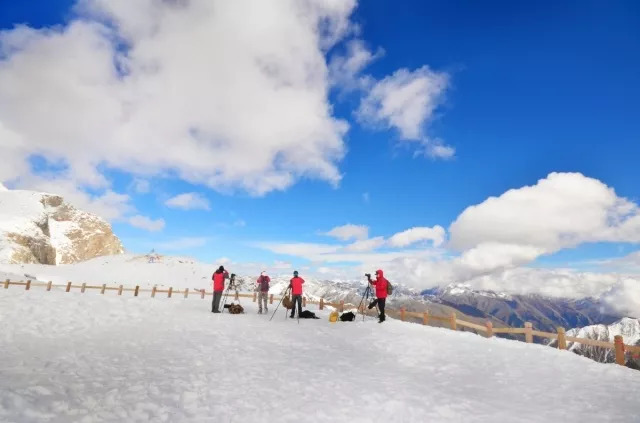

# 川西北小环线
## 行程计划
 

### D1 重庆-雅安 
全程高速，大约5个小时左右。建议9月30日下午早点走，住雅安 提前预定酒店.

雅安是茶马古道的重要节点，有著名的三雅：雅鱼、雅女、雅雨，可以去试下雅鱼（我没吃过）,回来说下味道。

> 雅安城外的茶马古道群雕

### D2 雅安-新都桥 
200公里，4个小时，住新都桥，中途视情况找店解决午餐。一半高速一半山路，路况很好，雅安到康定全程高速，出康定后就开始翻越4200米海拔的折多山垭口。康定县城海拔2500，垂直上升1800米，大概率会高反，在垭口游玩时注意不要激动、跑跳。建议准备歌曲《康定情歌》沿路播放。

翻越垭口后，下山不远就进入新都桥，整个新都桥都是著名的摄影天堂，一路上风景非常漂亮，可以选择在路边的藏家客栈住宿，价格便宜，也可选择自带帐篷在院子里露营。也可以选择在新都桥镇上找酒店住宿，可提前预定。但我觉得如果按这个计划时间，找住宿问题不大。

如果顺利雅安高速直通康定，如果高速有管制，需要翻越二郎山，到达新都桥的时间应该是下午4、5点了，所以最好提前了解雅安到康定高速的情况，如果走老路尽量早点走。如果走老路可以去泸定桥看看。

> 著名的跑马山

> 折多山垭口

> 新都桥

### D3 新都桥-丹巴  
140公里 3小时，住丹巴，可选择在八美午餐，或者带路餐。此段路线非常漂亮，整个行程的精华，路过塔公草原、雅拉神山、八美等，每个地方都非常漂亮。

丹巴县城住宿较贵（15年600一晚上），如无法提前预定，可以住路边藏家客栈，价格较低。另外丹巴县城往金川方向5公里处的甲居藏寨景点有大量客栈。

> 塔公寺和雅拉雪山

> 协德惠远寺（据说是[龙多活佛](http://www.baike.com/wiki/%E9%BE%99%E5%A4%9A%E6%B4%BB%E4%BD%9B)的道场）

### D4 丹巴-达古冰川 
340公里 7个小时，住黑水县，午餐可选择在金川县城解决。这条路线我没走过，不过这边的路问题不大，应该都是柏油路。路上风景看运气，一路顺着大渡河走。

丹巴在交通上是一个是十字路口，西接道孚炉霍、右连小金、北通金川、下达泸定。以众多的土司碉楼群闻名。县城往金川方向出城5公里左右的甲居藏寨最为有名，是相对成熟的旅游景点，客栈很多。另外还有一个有名的景点叫美人谷，县城往金川方向26公里左右。以上两处景点都会途经，不需要绕路。

注意这一天总行程3百多公里，要注意控制时间。

> 丹巴的土司碉楼

> 藏寨

### D5 达古冰川-古尔沟
160公里 3.5小时，住古尔沟或黑水，白天肯定在景区中，准备路餐。达古冰川 游玩一天。达古冰川游玩后，到古尔沟泡温泉，住古尔沟镇，住宿问题不大，此处会走一小段回头路。

达古冰川我本人没去过，朋友推荐过。大概风景是大量的高山湖泊加冰川景色，高海拔的索道，4800米的观景台。4800海拔的观景台，温度肯定会到零下，注意保暖衣物，另外准备墨镜，周围全是雪的情况下，眼睛长期暴露会有出现雪盲症状。这里可能是你我能到达的最高海拔。

门票，门票120元/张，观光车70元/人，索道180元/人；开放时间，8:00-19:00（最晚入园时间15:30）

如果从景区出来还早，就再开3个多小时车去古尔沟住温泉酒店，泡下温泉，太晚了就直接住黑水县。

### D6 古尔沟-成都
230公里 5小时，住成都或直接回重庆，午餐可选择在汶川或都江堰解决。路过桃坪羌寨可花2小时游览（黄渤拍《杀生》的取景地），成都住一晚上，逛下锦里、宽窄巷子 。古尔沟镇有毕棚沟景区，是端午长坪沟的山的另一面，风景类型跟长坪沟相似，可坐观光车也可以步行，比较轻松。如果要去毕棚沟，就继续住古尔沟，D7直接回重庆。

桃坪羌寨在理县县城往汶川方向36公里处，注意不要走过了。

> 桃坪羌寨

> 桃坪羌寨

### D7 成都-重庆
260公里，3小时，住温暖的家。

## 必要的准备
### 衣物
此次行程的路线的平均气温应该在几度~二十几度之间，高原昼夜温差大，白天有太阳时可以到20几度，晚上会到几度。另外有两处高海拔的地方，又下雪的可能。羽绒服一定要带。另外此次在高原暴露的时间较长，一定要准备防晒霜，SPF50+以上的，不是开玩笑，不准备回来准备脱皮。被动防晒方面，准备帽子、墨镜(买带偏光的）、头巾等。还有防雨措施，端午节的教训大家应该记忆犹新。

### 食物
有几天会在路上，虽然可以找路边餐馆解决，准备一些方便饭，找个路边风景好的地方，就地解决也是一件很有趣的事情。另外准备一些高热量的零食，巧克力、牛肉干等，

### 保险
一定要买，户外险。

### 费用
除了交通费和食宿费，几个景点都有一些门票，达古冰川较高，其他的地方不多。

### 其他
在寺庙里看好娃儿。不要得罪藏民。

Enjoy
