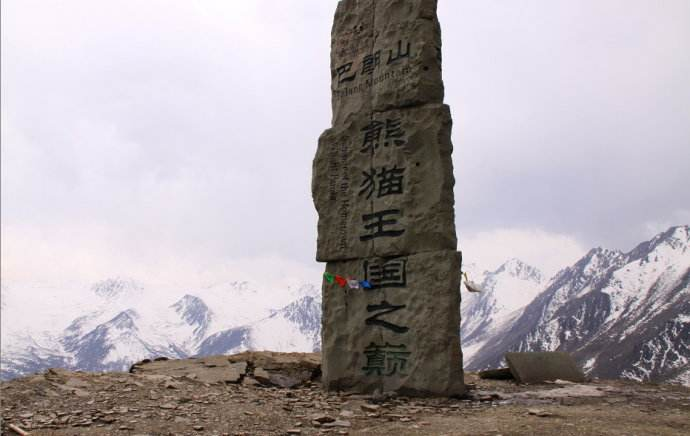

# 端午四姑娘山路书

四姑娘山位于四川省小金县境日隆镇（现在改名叫四姑娘山镇），是距离重庆最近的一处真正意义上的高原、雪山景区，有东方阿尔卑斯之称。四姑娘山主要由4座5千米海拔以上的山峰组成，其中主峰“幺妹峰”海拔高度6250米，是四川第二高峰，常年积雪，仅次于被誉为“蜀山之王”的贡嘎山，人称“蜀山皇后”、“东方圣山”。除了4座山峰，景区主要由3条峡谷组成，分别是双桥沟、长平沟和海子沟。

四姑娘山距离成都200公里左右，从成都出发经过成灌高速到达都江堰，再走都江堰-映秀-耿达-卧龙-巴朗山-日隆。这条路在512时被完全埋掉，在16年的时候才从新修通，目前整条路基本由隧道组成，路况非常好，只是无法欣赏高山峡谷的风貌了。这条路有3个亮点，在映秀可以诳一下地震展览馆，卧龙可以逛一下熊猫基地，巴朗山垭口海拔4500米，被称为熊猫王国之巅，在垭口可以遥望卧龙峡谷，运气好可以看到云海。

## 具体计划如下：
本次端午节出行，除去路上的时间，实际游玩时间在2天左右，第一天主要是参加当地一年一度的朝山会，感受藏地的文化。第二天选择游玩一条沟。3条沟的风格各不相同，中老年适合双桥沟，全称基本上坐观光车游玩，半天搞定;长平沟全称徒步，走到木骡子折返回来，一天走完，虽然比较长，但普通人基本都能完成，路很好走；海子沟最野性，基本上游客都会选择骑马，到达大海子景点再折返回来，基本上也需要一天的时间，这条路也是攀登四姑娘山的必经之路。

### 日程安排
6月6日请半天假，中午1点钟出发，走渝蓉高速到成都然然后直接开到日隆，中途根据时间可以选择在都江堰吃晚饭或者耿达。根据时间确定是否可以去卧龙看熊猫。住日隆。
重庆->成都->都江堰->映秀->耿达->卧龙->日隆

6月7日一早出发到海子沟参加朝山会。朝山会在海子沟的锅庄坪景点举行，需要徒步1小时左右，小小体验下高原原始丛林徒步的感觉。当天海子沟免门票。早餐客栈解决，中午吃路餐，晚餐客栈解决。

6月8日根据大家意愿选择具体游玩哪一条峡谷。午餐路餐。

6月9日一早出发回重庆。回城路线有两条路线选择可以原路返回，这条路比较轻松。如果不想走回头路可以走宝兴->雅安->乐山->重庆这条路，这条路会多100公里，并且时间会上很可能会不止100公里，不过可以体验不一样的路上的风景和乐山的美食。

## 费用：

费用主要由交通费、住宿、景区门票构成，人均应该在1000以内（按4个人一个车计算）。
## 准备工作
高原地区早晚温差较大，需要带的穿的衣服最好覆盖10~30度左右的温差范围。可以准备防晒霜和墨镜、帽子等，高原地区紫外线很强。如果有冲锋衣可以带冲锋衣，如没有可以带把伞也可以，鞋子以方便长时间走路为好。另外需要准备2~3顿的路餐和零食等，最好准备一些巧克力、牛肉等高热量的零食，可以考虑统一采购。
## 风险
出行前统一购买户外意外保险。另外高原天气不可预测，可能运气不好下两天雨。